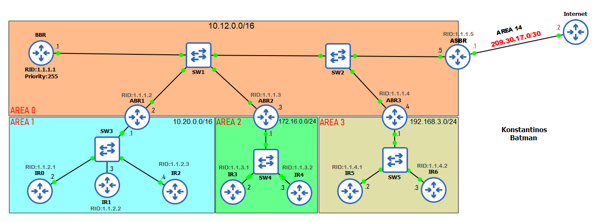

### Multi-Area OSPF



- This is a practical multi-area OSPF lab designed to demonstrate hierarchical OSPF design.
- The lab includes 5 OSPF areas (0, 1, 2, 3, and 14) with proper ABR placement and external route redistribution via ASBR.
- The end goal is to achieve **full connectivity between all areas** while maintaining OSPF hierarchical design principles.

## Network Topology & Addressing

| Device   | Interface | IP Address        | Area | Notes             |
|----------|-----------|-------------------|------|-------------------|
| **BBR**  | G0/0      | 10.12.0.1/16     | 0    | Backbone Router   |
|          | Router ID | 1.1.1.1           |      | Priority: 255     |
| **ABR1** | G0/0      | 10.12.0.2/16     | 0    | Link to Area 0    |
|          | G0/1      | 10.20.0.1/16     | 1    | Link to Area 1    |
|          | Router ID | 1.1.1.2           |      | Area Border Router|
| **ABR2** | G0/0      | 10.12.0.3/16     | 0    | Link to Area 0    |
|          | G0/1      | 172.16.0.1/24    | 2    | Link to Area 2    |
|          | Router ID | 1.1.1.3           |      | Area Border Router|
| **ABR3** | G0/0      | 10.12.0.4/16     | 0    | Link to Area 0    |
|          | G0/1      | 192.168.3.1/24   | 3    | Link to Area 3    |
|          | Router ID | 1.1.1.4           |      | Area Border Router|
| **ASBR** | G0/0      | 10.12.0.5/16     | 0    | Link to Area 0    |
|          | G0/1      | 209.30.17.1/30   | 14   | External/Internet |
|          | Router ID | 1.1.1.5           |      | AS Boundary Router|
| **IR0**  | G0/0      | 10.20.0.2/16     | 1    | Internal Router   |
|          | Router ID | 1.1.2.1           |      |                   |
| **IR1**  | G0/0      | 10.20.0.3/16     | 1    | Internal Router   |
|          | Router ID | 1.1.2.2           |      |                   |
| **IR2**  | G0/0      | 10.20.0.4/16     | 1    | Internal Router   |
|          | Router ID | 1.1.2.3           |      |                   |
| **IR3**  | G0/0      | 172.16.0.2/24    | 2    | Internal Router   |
|          | Router ID | 1.1.3.1           |      |                   |
| **IR4**  | G0/0      | 172.16.0.3/24    | 2    | Internal Router   |
|          | Router ID | 1.1.3.2           |      |                   |
| **IR5**  | G0/0      | 192.168.3.2/24   | 3    | Internal Router   |
|          | Router ID | 1.1.4.1           |      |                   |
| **IR6**  | G0/0      | 192.168.3.3/24   | 3    | Internal Router   |
|          | Router ID | 1.1.4.2           |      |                   |

## Configuration Highlights

- **Area 0** serves as the backbone area connecting all other areas through ABRs
- **ABRs** connect non-backbone areas to Area 0, maintaining OSPF hierarchical design
- **ASBR** redistributes external routes and provides default route injection
- **Router IDs** follow structured2 numbering: Area 0 (1.1.1.x), Area 1 (1.1.2.x), etc.
- **Interface costs** are configured to influence optimal path selection

## Key Commands Used

### BBR (Backbone Router) Configuration
```cisco
router ospf 1
network 10.12.0.0 0.0.255.255 area 0
router-id 1.1.1.1
```


### ABR1 (Area Border Router) Configuration
```cisco
router ospf 1
network 10.12.0.0 0.0.255.255 area 0
network 10.20.0.0 0.0.255.255 area 1
router-id 1.1.1.2
```


### ABR2 (Area Border Router) Configuration
```cisco
router ospf 1
network 10.12.0.0 0.0.255.255 area 0
network 172.16.0.0 0.0.0.255 area 2
router-id 1.1.1.3
```


### ABR3 (Area Border Router) Configuration
```cisco
router ospf 1
network 10.12.0.0 0.0.255.255 area 0
network 192.168.3.0 0.0.0.255 area 3
router-id 1.1.1.4
```


### ASBR (Autonomous System Boundary Router) Configuration
```cisco
router ospf 1
network 10.12.0.0 0.0.255.255 area 0
network 209.30.17.0 0.0.0.3 area 14
router-id 1.1.1.5
default-information originate
!
ip route 0.0.0.0 0.0.0.0 209.30.17.1
```


### Internal Router (IR0) Configuration (Is the same for the other IRs)
```cisco
router ospf 1
network 10.20.0.0 0.15.255.255 area 1
router-id 1.1.2.1
```

### OSPF Cost Change (On All routers)
```cisco
interface GigabitEthernet0/0
ip ospf cost 10000
```

## Verification Commands

### Check OSPF Neighbors
```cisco
show ip ospf neighbor
show ip ospf neighbor detail
```

### Verify OSPF Database
```cisco
show ip ospf database
show ip ospf database summary
show ip ospf database external
```

### Check Routes
```cisco
show ip route ospf
show ip ospf border-routers
```

### Verify Areas
```cisco
show ip ospf
show ip ospf interface brief
```

### Test Connectivity
```cisco
ping 10.20.1.1 source 192.168.3.1
ping 172.16.0.1 source 10.20.1.1
traceroute 192.168.3.1 source 10.20.1.1
```

## Expected Results

- **Area 0**: Should see all ABRs as neighbors
- **ABR1**: Should have neighbors in both Area 0 and Area 1
- **Internal Routers**: Should only see neighbors within their own area
- **ASBR**: Should advertise default route (0.0.0.0/0) to all areas
- **Inter-area routes**: Should appear as `O IA` (OSPF Inter-Area) in routing table
- **External routes**: Should appear as `O E1` or `O E2` in routing table

## Troubleshooting Tips

- Ensure **Area 0 connectivity** for all ABRs
- Verify **Router IDs are unique** across the entire OSPF domain
- Check **area numbers match** on both sides of links
- Confirm **authentication keys match** on connected interfaces
- Use `debug ip ospf events` for adjacency issues

### Feel free to clone this project and modify the configurations to fit your own scenarios. Multi-area OSPF requires careful planning, but mastering it is essential for large-scale network design!
